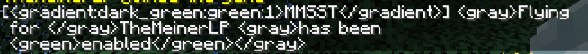
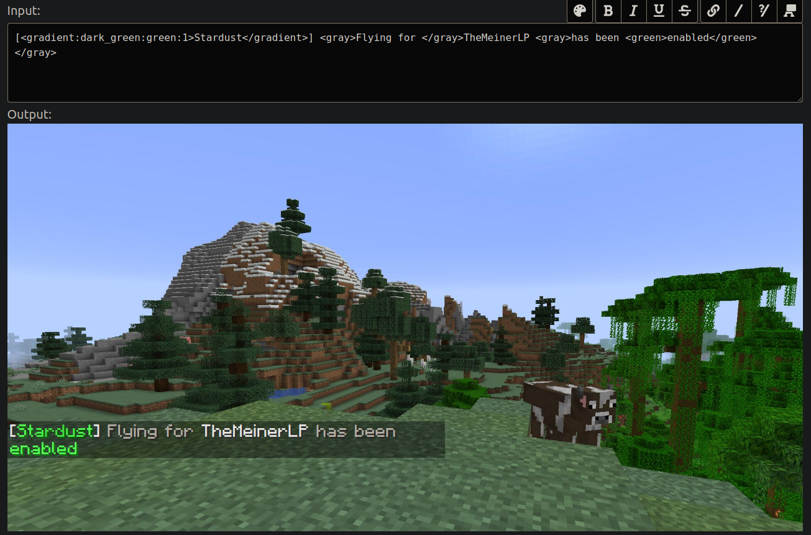

# MiniMessage Server Side Translation
This project is a minimal reproducible example. That's helps me and us to reach the point of allow developers to use the kyori translation system more effective. 

## Current issue
The mini message don't get parsed and transformed to the right translatable.  

Changes from Joo2000: 
We escaped the nested lang tag and the second parameter(Playername)
Changes from LynxPlay:
Add a wrapper around your registry.

Old Output:

Previous Output:

Current Output:

Expected output: 
